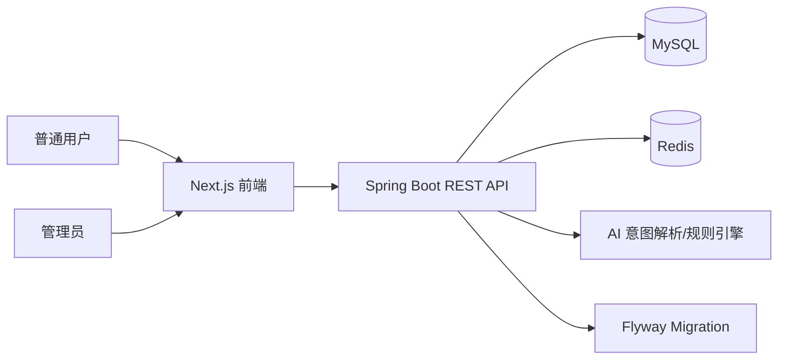
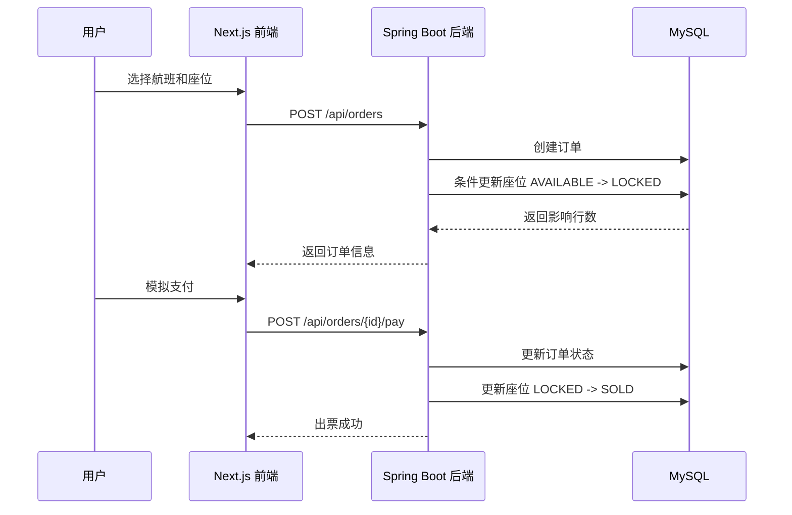
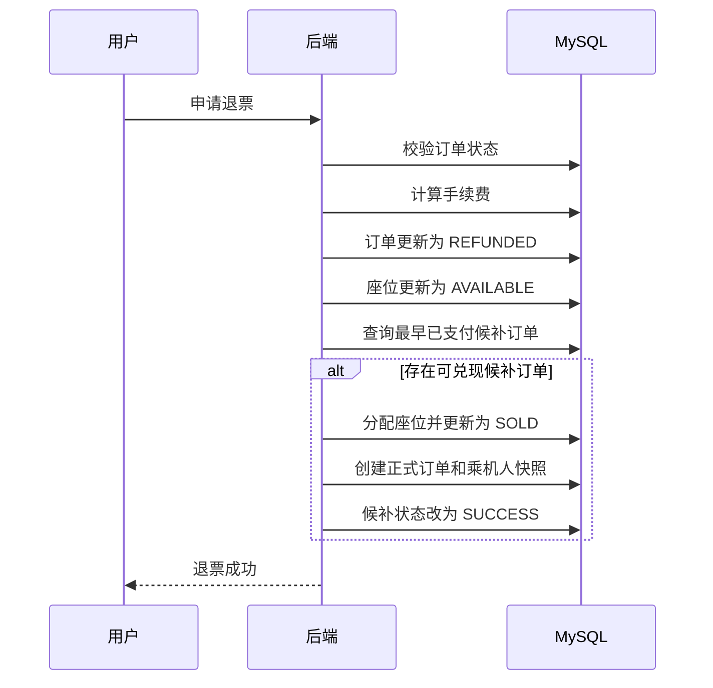
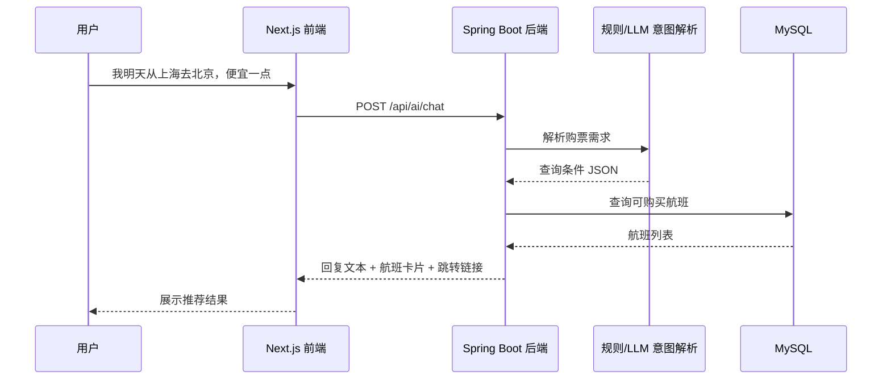

# 04_ARCHITECTURE：项目整体架构

## 1. 总体架构

本项目采用前后端分离架构。



## 2. 前端架构

前端负责：

- 页面路由；
- 用户交互；
- 航班卡片展示；
- 筛选条件管理；
- AI 聊天界面；
- 订单流程步骤展示；
- 后台管理页面。

前端不直接访问数据库，所有数据通过后端 API 获取。

## 3. 后端架构

后端负责：

- 用户认证与权限控制；
- 航班查询；
- 座位状态管理；
- 订单状态流转；
- 库存并发控制；
- 候补排队；
- 退票与改签；
- AI 助手条件解析和航班推荐；
- 管理后台接口；
- 数据统计。

## 4. 模块划分

```text
backend
├── auth        认证与权限
├── user        用户
├── passenger   乘机人
├── airline     航司
├── airport     机场
├── flight      航班
├── seat        座位
├── order       订单
├── refund      退票
├── change      改签
├── waitlist    候补
├── ai          智能购票助手
├── admin       管理后台
└── common      公共模块
```

## 5. 典型业务流程：订票



## 6. 典型业务流程：退票与候补



## 7. 典型业务流程：AI 智能购票助手



## 8. 架构原则

### AI 不直接生成业务数据

AI 只负责理解用户意图，不直接编造航班、价格和库存。

### 订单与座位强一致

订单状态变化必须同步影响座位状态。

### 管理端和用户端隔离

用户端强调体验，后台强调效率。

### 数据库迁移版本化

所有数据库结构和初始化数据由 Flyway 管理。
